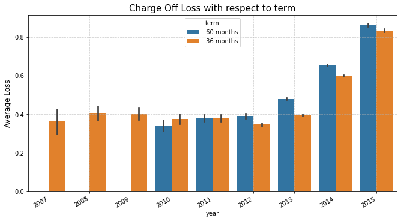

## Predicting Probability of Default of Lending Club loans

### About Lending Club
Lending Club is a peer to peer lending company based in the United States, in which investors provide funds for potential borrowers and investors earn a profit depending on the risk they take (the borrowers credit score). Lending Club provides the "bridge" between investors and borrowers. For such companies who are in the lending business, calculating the probability of default can help estimate the expected income in the near term. For banks this can be used to ensure that they meet the regulatory capital requirements. 

### Project Objective
Build a machine learning model to predict the probability of deafult in the next month for lending club,s loan portfolio. 

### Data Source
I am using this data set : https://www.kaggle.com/husainsb/lendingclub-issued-loans

### Defining Loan Default 
A loan can go through different statuses during its life cycle. 
- When the borrower is paying as per schedule, then the loan is in 'Current' status. 
- When the borrower is late on any interest payments, the loan moves to D30 status which means that he is more than 30 days late on his payments. This now becomes a 'NPL' or a Non performing loan. 
- If he does not pay the second EMI as well, the loan moves into D60 status. 
- Similarly , D60 is followed by D90, D120 and D180. 

If he wants to go to current status, he would have to repay all of the missed interest payments. If the borrower pays only some portion of the interest, he moves from D180 to D60 or D30 based on the amount he paid. If the borrower does not pay, the loan is moved into 'Charge off' status. This means that the company thinks the customer is never going to pay back so they just charge off the loan from their books. This is the stage where the borrower's collateral (Eg. for mortgage loans it is the home equity) is sold to recover the missing payments. 

### Motivation for the project
In this project I am going to estimate the probability of final default or charge off of the loan. (not the intermediate default stages like D30, D60 etc.). I do this because when the customer starts defaulting, there is still hope to recover the lost payments but once he is charged off, the company really looses money.  Hence I consider this to be more useful estimate for the company. 

## Exploratory Data Analysis 

### Imbalance Data Check - Fraction of defaulted loans 
The Charged Off loans are only 5% of the entire loan portfolio

### Proportion of Charge Offs and Interest rates over Time
- The highest number of charge offs so far occured are in 2013 and 2014, they have gradually increased over time and then they fell a lot in 2015
- This compares correctly with the increase in Average interest rates of the loans. The average interest rates have been steadily growing over time and the Charged off loans have a always have a higher interest rates. This means the customers with higher interest rates are more likely to default and undergo charge off

  
   

### Total Payments

### Recoveries
- Firstly we have defined the total recoveries to be the recovered amount and the recovery fees collected by Lending Club.
- Now we are looking at the percentage of loans charged off and recovered in each year. We see that the charged off loans increased a lot during 2013-15 but the recoveries also increase during this period so thats good.
- Here we can see that the percentage of loans recovered after charge off has steadily been increasing over time and shot up a lot in 2015. It used tb around 2% but increased to 9% in 2015

  
   

### Cumulative Charge Off  
- Although the recoveries have been increasing in number, the dollar value of recoveries is less as compared to the dollar value of charge offs.
- As a result we see that the charge off Loss has grown steadily over time

  
   

### Number of charge off loss wrt Grade and Term of Loan 
This shows that people belonging to all grades have incurred the same amount of losses in terms of value but the number of charge offs are higher for C and D grade borrowers.

  
   

## Model Development

| Logistic Regression   |      XG Boost Classifier      |  
|----------| -------------|
| ROC is 0.53 so classifier is almost random | The log score and brier score have reduced significantly | 
| Log loss score and brier score are decent but model lacks predictive performance. |  We observed that the ROC , precision and recall improved for the XGBoost model.   |  
| This is possible because of the highly imbalanced dataset (5% of Charge off loans) | Recall is good but precision and F1score are bad and this is due to the class imbalance. |    
| Here Recall is more important. Its more dangerous to wrongly accept a bad customer (FN is important)' | So even here the reliability curve is not nice, the probabiliies are still not calibrated. |   
|  |  |   

## ROC Curves 

  
   

